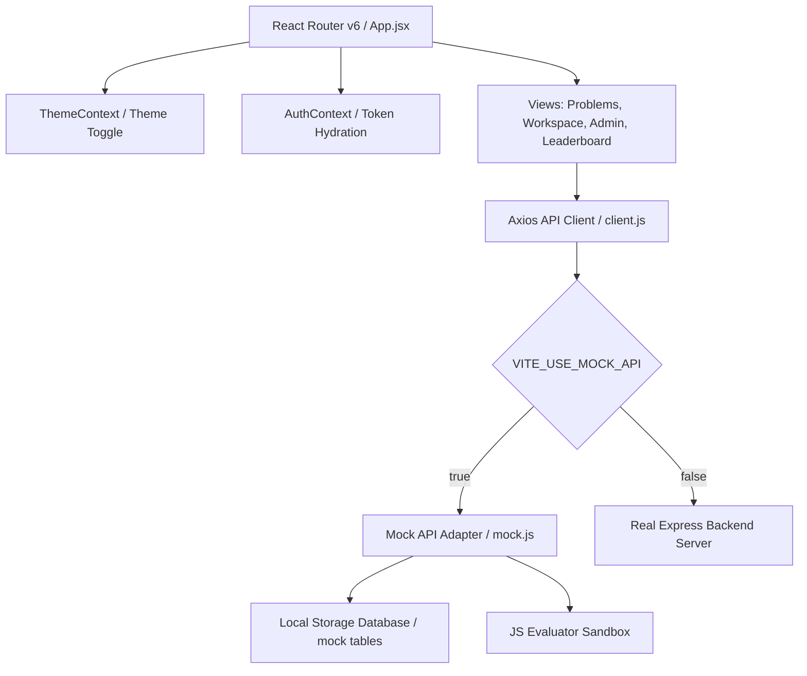

# Project Handover Report: OJ{ 0 } (React Online Judge)

This document serves as a complete knowledge-transfer and handover report for the **OJ{ 0 } (Online Judge)** project. It details the initial goals, database schemas, architectural design, execution history, challenges solved, future roadmaps, and repository states.

---

## 💡 1. Project Concept & Idea

**OJ{ 0 }** is a minimalist, high-fidelity React Single-Page Application (SPA) designed as an automated algorithmic evaluation platform (similar to Codeforces and LeetCode). It hosts coding problems, executes user submissions against test cases, outputs compilation/runtime diagnostics, and maintains structured discussion threads.

As a co-op project, the focus is strictly on **Frontend UI design** and **API client compatibility**. The application includes a togglable client-side **Mock API Layer** that intercepts network requests using an Axios adapter and simulates a PostgreSQL database inside browser `localStorage`. This allows the entire application to run standalone immediately without requiring a running database server.

---

## 📋 2. Core Specifications & Requirements

### 1. Interface & Aesthetics
* **Theme System**: Minimalist, high-contrast typography, and smooth transitions supporting:
  * **Light Mode (Ivory shade)**: Clean warm ivory background (`#FAF9F5`) and white surface elevations.
  * **Dark Mode (Charcoal shade)**: Matte dark gray background (`#121212`) and elevated dark containers.
* **Layout Surfaces**:
  * **Public Pages**: Hero landing page, a problem list page, a leaderboard of coders, and a workspace.
  * **Auth Pages**: Login and signup pages, including shortcut "quick login" credentials.
  * **Admin Panel**: Role-guarded CRUD problem publisher, topics checklist, and test cases sub-panel.

### 2. Question Schema Structure
All problem statements are represented in the UI and created in forms matching this exact schema:
* `id of question`: Unique string/ID (e.g. `Q1`)
* `description`: The detailed problem statement.
* `constraints` (written as `constrains` in DB schema): Value limits.
* `input`: Sample input parameters.
* `output`: Expected sample output.

### 3. Database Schema Mapping (ER Alignment)
The frontend forms, variables, and API request bodies correspond directly to these tables:
* **`problems`**: `id`, `title`, `slug`, `description`, `difficulty`, `constrains`, `timilimt` (ms), `memorylimit` (MB), `acceptanceCount`, `submissionsCount`, `exampleSchema` (`[input, output, explanation]`), `codeTemplateSchema` (`[language, starterCode]`), `solutionSchema` (`[language, code]`), `functionName`, `parameterTypes`, `hints`, `createdAt`.
* **`submissions`**: `id`, `userId`, `problemId`, `code`, `language`, `status` (`AC`, `WA`, `CE`, `RE`), `runtime`, `memory`, `passedTestCases`, `totalTestCases`, `executionTime`, `errorOutput`, `compileOutput`, `executionOutput`, `submittedAt`.
* **`discussions`**: `id`, `userId`, `problemId`, `title`, `content`, `createdAt`.
* **`test_cases`**: `id`, `problemId`, `input`, `expectedOutput`, `isHidden` (differentiates public sample test cases from secret submission checks).
* **`topics` & `problem_topics`**: Mapped relationally to support tags categorization.

---

## 🏗️ 3. Architectural Design

### 1. In-Memory JWT & Split Refresh Interceptor
* To protect against XSS, the short-lived `accessToken` is kept strictly in-memory (in context state).
* The long-lived `refreshToken` is handled via secure `httpOnly` cookies.
* When the app mounts, it calls `POST /auth/refresh` to secure a new access token (silent hydration).
* If any API request fails with a `401 Unauthorized` response, the Axios interceptor (`src/api/client.js`) pauses the queue, calls `/auth/refresh` to secure a new `accessToken`, updates the default header, and transparently retries all queued requests.

### 2. Client-Side JavaScript Evaluator Sandbox
For JavaScript submissions, the mock server evaluates the code inside the browser. It compiles the function dynamically using `new Function()`, feeds the parameters parsed from `test_cases`, compares the return outputs, logs syntax/runtime errors, and generates execution analytics.

---

## ⚙️ 4. Execution History & Milestones

The project was built incrementally, maintaining Git author configurations under "Bansal" (`sumitbansal1290@gmail.com`):
1. **Commit 1**: `feat: init project with vite, routing, and directory skeleton`
2. **Commit 2**: `style: implement global layout and core dark-theme design tokens` (Added typography, ivory light mode, charcoal dark mode, ThemeContext, AuthContext, and Axios config).
3. **Commit 3**: `feat: implement problem list and leaderboard pages` (Created filterable tables and Codeforces-style rank titles).
4. **Commit 4**: `feat: create problem workspace with client-side code executor and comments` (Built dual-pane editor workspace and local JS run engine).
5. **Commit 5**: `feat: build admin panel with problem CRUD` (Built the problem creator form).
6. **Commit 6**: `docs: add readme detailing architecture and api compatibility`
7. **Commit 7**: `chore: add pages deploy workflow` (Added GitHub actions config).
8. **Commit 8**: `chore: force node24 in deploy workflow` (Addressed node runner deprecations).
9. **Commit 9**: `fix: set router basename to base_url for github pages` (Fixed subpath navigation routing).
10. **Commit 10**: `chore: change site title to OJ{ 0 }` (Changed webpage header brand).
11. **Commit 11**: `feat: update mock api and database seed with new er schemas` (Upgraded schemas to map to the new database ER diagram).
12. **Commit 12**: `feat: refactor problem workspace with test case runners and dynamic templates` (Updated workspace limits, dynamic templates, hints, and accordion discussions).
13. **Commit 13**: `feat: update admin panel to support advanced problem metadata and test case management` (Added example builders, topic checklists, and interactive test case sub-panels).
14. **Commit 14**: `feat: update problems search and filters to query relational topics`

---

## ⚠️ 5. Challenges Solved

### 1. PowerShell Script Execution Restrictions
* **Problem**: Executing standard `npx` or `npm` commands directly failed on Windows because PowerShell execution policies blocked the `.ps1` wrapper files.
* **Resolution**: Directed execution through `.cmd` wrappers (`npx.cmd` and `npm.cmd`), bypassing script block policies without modifying system configurations.

### 2. GitHub Pages Subpath 404 & Routing Failures
* **Problem**: GitHub Pages hosts repositories under subpaths (`/Online_Judge/`), resulting in broken assets (404) and broken routing links (which default to root `/`).
* **Resolution**:
  * Set `base: '/Online_Judge/'` inside `vite.config.js`.
  * Set `<Router basename={import.meta.env.BASE_URL}>` inside `src/App.jsx`. Vite automatically injects the correct base path during compilation, resolving subpaths.

### 3. Git Credentials Conflict
* **Problem**: Push requests failed with 403 authorization denials because local credentials managers had cached credentials for a different user.
* **Resolution**: Cleared cached Git credentials in Windows Credential Manager or authenticated via collaborators invitations to grant push permissions.

---

## 📌 6. Future Roadmap & Pending Tasks

To transition this frontend workspace to production with a real backend:
1. **Toggle Mock Mode**: Edit `.env` to set `VITE_USE_MOCK_API=false` and set `VITE_API_URL` to point to your backend hosting server (e.g. `https://api.oj0.com/api`).
2. **Secure Cookies Deployment**: Ensure your Express server enables `cors` with `credentials: true` and sets HTTP cookies with `secure: true; sameSite: 'none'` in production to support the token refresh interceptor.
3. **Sandboxed Docker Compilation**: Replace the client-side JavaScript execution engine with an asynchronous queue that submits code to a sandboxed Docker runtime on the server, returning verdicts via WebSockets or long-polling.
4. **Active Leaderboard Syncing**: Periodically recalculate rating scores on the server side instead of running dynamic counts on the client.

---

## 🎯 7. Current Project Status
* **Repository**: `https://github.com/binaryNexus07/Online_Judge.git` (main branch).
* **Live Deployment**: Deployed live on GitHub Pages at `https://binarynexus07.github.io/Online_Judge/`.
* **Build State**: Compiles cleanly with zero errors/warnings (`npm run build` completed successfully).
